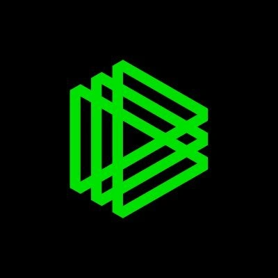
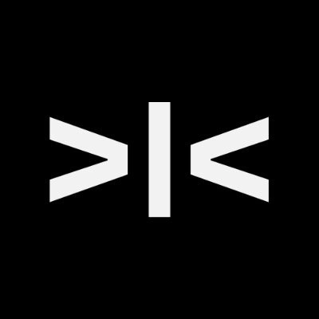
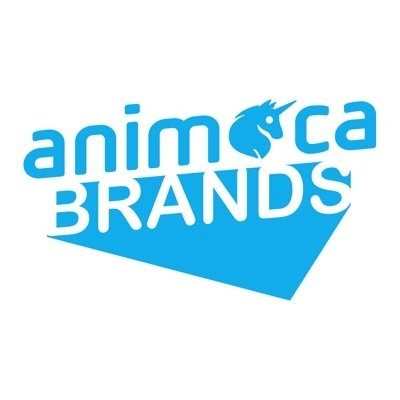
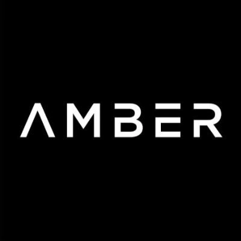
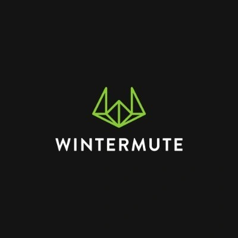
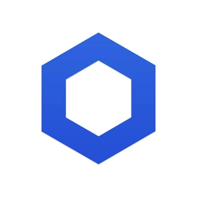
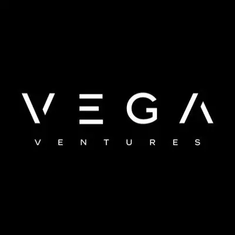
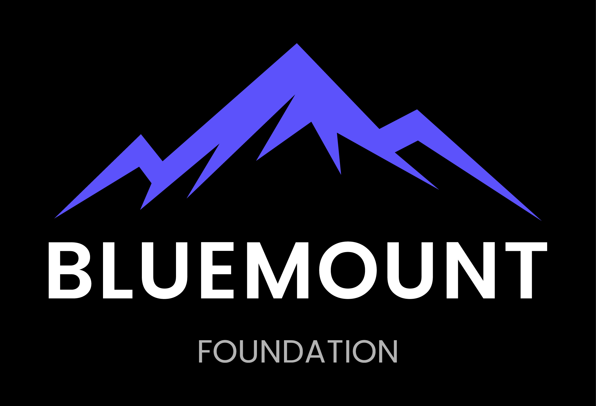

<div align="center">


# Kairos 白皮书

### 汇聚共识 · 预见关键一刻

**AI 原生的 Web3「预测市场 × RWA 事件」协议 · 流量与空投的超级聚合器**

版本 v0.2 ｜ 2026-06 ｜ 简体中文

</div>

> 本白皮书为产品与技术说明文档，聚焦平台机制、生态与市场，**不构成任何投资建议**，亦不包含代币发行条款。文中部分行业数据来自公开报道；市场规模、官方带单收益、复利演示等均为**示例性 / 行业预测数据**，规则可调，需以平台后续正式公告为准。完整免责声明见文末。

---

## 目录

1. [摘要](#1-摘要)
2. [投资方与战略支持](#2-投资方与战略支持)
3. [行业背景：万亿级赛道的崛起](#3-行业背景万亿级赛道的崛起)
4. [现状痛点](#4-现状痛点)
5. [Kairos 总体方案与愿景](#5-kairos-总体方案与愿景)
6. [核心机制](#6-核心机制)
7. [AI 原生：Kairos 的智能内核](#7-ai-原生kairos-的智能内核)
8. [产品与用户体验](#8-产品与用户体验)
9. [官方带单：雷达带单与保本收益](#9-官方带单雷达带单与保本收益)
10. [流量聚合器与空投聚合](#10-流量聚合器与空投聚合)
11. [平台架构与生态](#11-平台架构与生态)
12. [商业模式](#12-商业模式)
13. [增长与分发](#13-增长与分发)
14. [差异化与竞争格局](#14-差异化与竞争格局)
15. [市场机会](#15-市场机会)
16. [全球化战略与路线图](#16-全球化战略与路线图)
17. [团队](#17-团队)
18. [结语与风险免责声明](#18-结语与风险免责声明)

---

## 1. 摘要

**Kairos 是一个 AI 原生、链上透明结算的 Web3「预测市场 × RWA 事件」协议，同时是一座汇聚全球热点流量与生态空投的超级聚合器。** 它把真实世界正在发生的趋势与事件——金融、政治、气候、科技、体育、文化、娱乐、AI、粉丝经济、社会趋势——转化为**可定价、可交易、可验证的事件资产**。

Kairos 之名源自希腊语 **καιρός**，意为「决定性的、稍纵即逝的关键时刻」。预测市场的本质，正是让群体在对的时刻、对未来事件给出**可被结算的判断**：用交易价格聚合分散的信息，使「价格」收敛为「概率」。Kairos 要做的，是把这件事做得**人人可参与、结果可验证、流动性可持续**。

平台围绕一条价值链组织：**事件生成 — 流动性 — 结算验证（全链路基建）**；并在其上叠加三层放大器：

- **AI 内核**——以智能体矩阵贯穿市场创建、信号带单、风控与个人「预见助理」，把复杂的金融机制翻译成人人秒懂的对话与概率（第 7 节）。
- **官方带单**——以 AI 信号引擎 + 量化做市台，每日精选高确定性事件做**保本、保底收益**的官方带单（第 9 节）。
- **流量与空投聚合**——预测是全球接受度最高的事件赛道，持续吸纳热点流量；投资方背后的顶级孵化网络，让参与者**从一个入口领取整片生态的空投**（第 10 节）。

> **Kairos 由全球顶级加密机构投资与战略支持**——包括 Paradigm、Dragonfly、Animoca Brands、Amber Group、Wintermute、Consensys、Chainlink、YZi Labs 等（详见第 2 节）。它们既是资本，也是 Kairos 流动性、结算、分发与**空投聚合**的资源底座。

---

## 2. 投资方与战略支持

> **Kairos 获得加密行业一线基金、做市商与核心基础设施方的投资与战略背书。** 这不仅是资本支持，更意味着 Kairos 在**流动性、预言机/结算、生态分发与合规**等关键环节，从第一天起就站在行业顶级资源之上。

<div align="center">

| | | |
|:---:|:---:|:---:|
|  |  |  |
|  |  |  |
|  |  |  |
|  |  | |

</div>

**为什么这些机构对 Kairos 至关重要：**

- **Paradigm** — 全球顶级加密风投，也是 Polymarket、Kalshi 等头部预测市场的核心投资方；其入局印证了「事件型金融」赛道的长期价值，并为 Kairos 带来该赛道最深的认知与网络。
- **Dragonfly** — 顶级跨境加密基金，在交易、基础设施与亚太生态拥有深厚布局，助力 Kairos 的全球化与在地化落地。
- **Animoca Brands** — Web3 游戏、娱乐与粉丝经济的领军者，与 Kairos「娱乐化、互动化的事件预测」定位高度契合，带来海量内容与社群入口。
- **Amber Group** — 头部数字资产金融与做市机构，为 Kairos 早期市场提供**流动性与做市**支持，直击预测市场「流动性不足」的核心痛点。
- **Wintermute** — 全球领先的算法做市商，深化 Kairos 订单簿深度、收窄价差、加速价格发现。
- **Consensys** — 以太坊核心基础设施公司（MetaMask、Infura 等），为 Kairos 的链上结算、钱包入口与开发者生态提供底层支撑。
- **Chainlink** — 行业领先的去中心化预言机网络，与 Kairos 的**结算验证**环节天然契合，是「事件结果可验证、可裁决」的关键合作方。
- **YZi Labs**（原 Binance Labs）— 全球最大交易所生态的投资机构，为 Kairos 在**分发、上所与合规**层面提供战略通路。
- **Vega · UZ Capital · Bluemount Capital** — 战略与区域投资伙伴，支持 Kairos 在多市场的拓展、运营与资源对接。

> 顶级风投提供**认知与资本**、头部做市商提供**流动性**、Chainlink/Consensys 提供**结算与基础设施**、Animoca/YZi 提供**分发与生态**——投资人阵容本身，就是 Kairos 解决预测市场结构性难题的「资源拼图」。

> **不止是投资人，更是一张孵化网络。** 这些机构同时是全球最活跃的**孵化器与早期基金**，手握大量被投与在孵项目。Kairos 把这张网络转化为用户红利：在平台参与预测、带单与任务，即可对接这些项目的**空投与白名单**——详见第 10 节「流量聚合器与空投聚合」。

---

## 3. 行业背景：万亿级赛道的崛起

预测市场正从「加密小众玩法」跨入**主流分发渠道**，并在过去两年迎来约 **130 倍**的规模增长，活跃用户合计已达 **1700 万以上**。它是当下**全球接受度最高的事件型赛道**：世界杯、总统大选、AI 突破、宏观降息——每一个全球热点都自带流量，而预测市场天然是这些热点的**承载器与放大器**。

按行业前瞻测算，事件型交易的规模阶梯大致为（**示例 / 行业预测**，非承诺）：

| 年份 | 行业规模（示例） |
|---|---|
| 2025 | 约 **510 亿美元** |
| 2026 | 约 **2400 亿美元** |
| 2030 | 约 **1 万亿美元** |

三股力量同时到位：

- **联邦监管框架**：美国 CFTC 为预测/事件合约开绿灯，并推动 Polymarket 重返美国市场；5 州试点正向 2026 年覆盖全美 38 州扩展。**监管风险已不再是主要瓶颈。**
- **交易与体育基础设施**：CME Group 代表的交易基础设施、FanDuel 与 DraftKings 代表的体育平台，已为事件型交易解决了「分发」问题。
- **主流验证已发生**：Kalshi 完成 10 亿美元 E 轮融资、估值升至 110 亿美元（Paradigm 领投）；ICE（纽交所母公司）战略投资 Polymarket 最高 20 亿美元（对应估值约 90 亿美元）；CNN、CNBC 与 Kalshi 达成预测数据独家/官方合作；Robinhood 拟扩张预测业务；Google Finance 接入 Kalshi 与 Polymarket 的赔率数据。

更关键的是**AI 拐点**：大模型让「把社交讯号自动结构化为可交易事件」「为每个用户实时解读概率」第一次变得可规模化——预测市场由此从「专业交易」走向「人人可参与的智能预见」。

> **结论**：预测市场正演变为一种「互动式娱乐 + 金融 + AI」的全新形态，主流机构与媒体已完成验证。**时机红利属于早期类别的开创者**——胜负关键在于**产品深度、AI 体验**与**在地化能力**。

---

## 4. 现状痛点

尽管赛道升温，当前预测市场仍存在四个结构性短板：

1. **流动性不足** — 早期与在地化市场流动性稀薄，滑点高、参与门槛高，用户难以顺畅进出场。
2. **理解门槛高** — 定价、赔率与交易机制偏金融化，多数用户缺乏清晰策略，难以稳定参与。
3. **在地化不足与资金摩擦** — 本土需求强烈，却缺乏本地化的预测话题、友善的法币入口与顺滑体验。
4. **结果验证困难** — 许多现实事件缺乏权威、可验证的结果来源，容易产生争议，侵蚀市场信任。

Kairos 的全部产品与机制设计，都是为系统性地解决这四点而生。

---

## 5. Kairos 总体方案与愿景

**愿景：让真实世界的趋势，成为可被定价、交易与结算的可验证事件资产；让任何人都能在 AI 的陪伴下，自信地预见关键一刻。**

Kairos 是 **AI 原生**的全链路「事件资产化」基建，把一条价值链完整串联起来：

```
事件生成  ──►  流动性  ──►  结算验证
（AI + 创作者）  （做市/套利）   （预言机 + DAO 裁决）
```

- **事件生成**：用 AI 与创作者，把社交讯号、热点趋势快速转化为结构化的预测话题，覆盖多领域。
- **流动性**：以中央限价订单簿撮合，配合做市与套利工具提供深度，让市场「买得进、卖得出」。
- **结算验证**：以可验证数据源 + 去中心化裁决，确保每个事件「有权威结果、可链上审计」。

「AI 原生」意味着 AI 不是附加功能，而是贯穿事件供给、信号生成、风控与用户体验的**底层引擎**（第 7 节）。Kairos 的定位由此清晰：**面向 Web2 与 Web3 用户的事件金融基础设施**。

| 痛点 | Kairos 的应对 |
|---|---|
| 流动性不足 | 做市/套利工具 + 共享流动性（含白标共享订单簿）+ 官方带单引流 |
| 理解门槛高 | AI 辅助探索 + 引导式新手体验，把交易翻译成「看涨/看跌 + 概率%」 |
| 在地化 + 资金摩擦 | 在地化话题 + 多语言 + 多币种法币入口 |
| 结果验证难 | 可验证预言机数据源 + DAO 审计与仲裁 |

---

## 6. 核心机制

### 6.1 预测市场原理

预测市场是一种为**「可验证的未来事件」**定价的市场机制：参与者交易与事件结果挂钩的合约，价格在竞争性交易中收敛为对结果的**概率判断**。

极简表达为：

```
Price ≈ E[Payoff]    若 Payoff ∈ {0, 1}，则  Price ≈ P(Event)
```

> 例：合约「到 2026 年底，比特币会达到 200K 吗？」——发生兑付 1、不发生兑付 0。若市场价格为 **0.72**，即市场隐含约 **72%** 的概率。

由此，预测市场实现了三件事：**信息聚合 · 责任化表达 · 可结算可验证**。

### 6.2 CLOB：中央限价订单簿定价

Kairos 采用中央限价订单簿（CLOB）撮合与定价。核心直觉是——**一张「到期必定值 \$1」的兑换券，被拆成互补的两半 YES / NO**：

- 事件**发生**：YES = \$1，NO = \$0；
- 事件**不发生**：YES = \$0，NO = \$1。

因此恒有：**YES 价格 `p` + NO 价格 `(1 − p)` ≈ 1**。例如「买入 YES @0.18」等价于「卖出 NO @0.82」（镜像报价）。

由于 YES/NO 是同一结果的两面，挂单会在另一侧自动生成镜像价，任何「YES + NO < 1」的不平衡报价会被直接撮合消除。两边合并为**同一个订单簿**，从而集中流动性、收窄价差、加速价格发现。

### 6.3 RWA 事件与事件资产化

传统 RWA（真实世界资产）指把债券、地产、商品等代币化。Kairos 将这一思路扩展到**真实世界的「事件 / 趋势」**：让现实事件本身成为可验证、可交易的资产。

这正是 Kairos 区别于传统单一类别预测市场的核心——**多领域 RWA 事件覆盖**：金融、政治、气候、科技、体育、文化、娱乐、AI、粉丝经济、社会趋势。热点天然具备社交传播性，与创作者驱动的分发形成正向循环。

### 6.4 预言机与结算验证

事件结果能否被**权威、可验证地裁决**，是预测市场的信任根基。Kairos 的结算验证由三层组成：

- **可验证数据源 + 链上结算**：所有费用与结算均于链上执行、可公开审计；
- **预言机网络**：对接行业领先的去中心化预言机（与 Chainlink 等的协作天然契合），为多品类事件提供可信结果输入；
- **DAO 审计与仲裁**：对争议事件引入社区审计与裁决机制，结算规则可共创、风控与合规框架可演进。

### 6.5 AI 智能体引擎

AI 是 Kairos 的底层引擎而非附加功能：它把趋势/热点自动结构化为预测话题、为用户实时聚合与解读信息、捕捉社群情绪信号，并驱动**官方带单的信号生成与风控**。这一引擎的完整架构，见第 7 节。

---

## 7. AI 原生：Kairos 的智能内核

如果说预测市场是 Kairos 的躯干，**AI 就是它的神经系统**。Kairos 不是「加了 AI 功能的预测市场」，而是从事件供给、信号生成、风控到用户交互**全程由 AI 智能体驱动**的事件金融网络。

**智能体矩阵（五大智能体）：**

1. **市场创建智能体** — 实时扫描社交讯号与新闻热点，把模糊趋势自动结构化为「可结算、可裁决」的预测话题，解决事件供给的速度与质量。
2. **信号 / 带单智能体** — 融合行情、赔率、跨市场价差与历史数据，输出高确定性场次的方向与仓位建议，是官方带单（第 9 节）的引擎。
3. **风控智能体** — 实时监控敞口、对冲覆盖率与准备金水位，对异常波动与结算风险预警，守护「保本/保底」承诺的可持续性。
4. **个人「预见助理」** — 面向每个用户的对话式 AI：用自然语言解释「这个市场在赌什么、当前概率多少、风险在哪」，把专业交易翻译成人人秒懂的判断。
5. **结算辅助智能体** — 聚合多源数据、辅助预言机与 DAO 完成事件裁决，缩短结算周期、降低争议。

**AI 数据飞轮（护城河）：**

```
更多交易/事件/结算数据 ──► 模型更准 ──► 信号与体验更优 ──► 更多用户与流量 ──► 数据更厚
                  ▲                                                         │
                  └─────────────────────────────────────────────────────────┘
```

随着平台事件与交易规模增长，数据持续回流、模型持续进化——这是后来者难以复制的复利护城河。

> **对话式预见**：用户只需问「美联储这次会降息吗？」，预见助理即给出背景、当前市场概率、相关联动市场与一键参与入口——把第 8 节「看涨/看跌 + 概率%」的体验，升级为一场与 AI 的对话。

---

## 8. 产品与用户体验

Kairos 把「专业、复杂」的预测交易，重塑为**直觉、轻量、社交化**的体验。一个普通用户的真实路径分为三段成长闭环：

1. **探索** — 看见洞察，而非复杂操作。从社交讯号直达预测机会。
2. **尝试** — 秒级注册、自信预测。可零成本、零风险地从模拟与引导起步，无需交易经验。
3. **参与 & 分享** — 参与、收获、扩展网络。从参与者成长为生态贡献者。

体验设计的三个关键：

- **AI 助理贯穿全程**：从探索到结算，个人「预见助理」随时解读市场、给出背景与概率，把 CLOB 的「买 YES / 卖 NO」翻译成人人秒懂的「看涨 / 看跌 + 概率 %」。
- **官方带单一键跟单**：高确定性场次由官方带单（第 9 节）直接呈现，新手也能跟随专业信号参与。
- **预测即内容**：每一次参与都可一键生成**话题卡片 / 收益卡片**，成为天然的社交传播素材——这与 CNN、CNBC 把预测概率嵌入新闻叙事的趋势同频，只不过 Kairos 把它交到每个用户手中。

---

## 9. 官方带单：雷达带单与保本收益

> **Kairos 官方带单，是把平台的 AI/量化能力，转化为普通用户可直接享用的确定性收益。**

**定义。** Kairos 设有官方「雷达带单」机制：由**官方团队 + AI 信号引擎 + 量化做市台**协同，每日从全网精选 **3 场高确定性事件**做官方带单，社群同步跟单。典型场次为结果明确、可裁决、流动性充沛的事件——如 **2026 美国中期选举（参众两院控制权）**、重大体育赛事、宏观数据（如美联储是否降息）等。

**承诺（限时、限额，规则可调）。** 参与官方指定场次的带单：

- **保本** — 参与本金受链上准备金保护；
- **保底收益** — 每单**保底 1%–3% 收益**，可复利滚存。带单收益以 **USDT** 计价结算。

### 为何可行（四根支柱，经得起推敲）

1. **AI / 量化边际** — 带单只选「模型评估概率」显著高于「市场隐含价格」、存在安全垫的场次。例：某事件市价 **0.62**、而 Kairos 模型评估为 **0.80**——这 0.18 的差值就是正期望的来源，而非凭空承诺。
2. **跨市场对冲 / 套利** — 同一事件在 Kalshi、Polymarket 等平台同时存在。Kairos 在外部市场反向锁价，**降低净敞口、锁定价差**，把方向性风险转化为结构性套利。
3. **真实营收 + 链上准备金兜底** — 保本与保底由平台手续费收入 + 专项「**带单准备金池**」共同支撑，**池子链上可审计**。它**显式非庞氏**：收益来自真实做市/套利边际与平台营收，**绝不靠新入金兑付旧收益**。
4. **获客成本视角** — Kairos 把部分做市边际与营销预算，以「保本带单」的形式让利给用户——这是一种**用确定性收益替代广告投放的获客策略**，因此天然是**限时、限额**的。

### 收益示例（示例数据，规则可调）

**① 通用示例。** 用户投入 **1 万美元**，参与每日 3 场带单，单日合计 3%–9%：

```
日收益 ≈ 10,000 × (3% ~ 9%) = 300 ~ 900 美元（不含复利）
```

**30 天保守复利演示**（按每日 +3% 保守口径，仅示意、非承诺）：

| 天数 | 本息合计（示例） |
|---|---|
| 第 1 天 | 10,300 |
| 第 7 天 | ≈ 12,299 |
| 第 15 天 | ≈ 15,580 |
| 第 30 天 | ≈ 24,273 |

> 以上为**示例性测算**，用于说明机制，不构成收益承诺；实际场次数量、收益区间与额度上限以官方公告为准。

**② 专项示例：一次「美国中期选举」带单全流程。**

```
发布信号 ─► 用户跟单 ─► 跨市场对冲 ─► 事件结算 ─► 收益分配 / 准备金兜底
  (AI)       (一键)      (量化台)      (预言机)        (链上)
```

AI 信号智能体评估某席位结果概率显著高于市价 → 官方发布带单信号、用户一键跟单 → 量化做市台在外部市场反向锁价、压低净敞口 → 选举结果由权威数据源 + 预言机裁决 → 盈利按规则分配；若出现极端偏差，由带单准备金池兜底保本。

### 守门条款

官方带单为**限时活动**，设**名额 / 额度上限**，**仅限官方指定场次**，平台保留最终解释权。参与须遵守**所在司法辖区**的适用法律法规，并知悉相应**风险提示**（详见第 18 节）。

---

## 10. 流量聚合器与空投聚合

### 10.1 流量聚合器

预测是全球**接受度最高**的事件赛道：世界杯、总统大选、AI 热点、宏观降息——全球每一波热点都自带海量流量，而预测市场是这些流量的**天然承载器与放大器**。Kairos 以多领域 RWA 事件、AI 体验与在地化分发，把分散在各处的事件热度，汇聚为平台的持续流量。

### 10.2 空投聚合（核心钩子）

**Kairos 背后的机构（Paradigm、Dragonfly、Animoca Brands、YZi Labs 等）皆为全球顶级孵化器**，手握大量被投与在孵的早期项目。这些项目都需要**真实用户、分发渠道与冷启动流量**——而 Kairos 正握有全网最活跃的事件流量。

由此形成一个独有的用户红利：在 Kairos 参与预测、官方带单与生态任务、持有「**生态通行证**」，即可对接这些**合作项目的空投与白名单**。

> **一个入口，领整片生态的红利。** 用户不必逐个去几十个新项目里做任务，只需在 Kairos 持续活跃，就能累计多个合作项目的空投份额。空投发放的是**合作方各自的代币**（非 Kairos 平台代币）。

### 10.3 聚合飞轮

```
全网热点流量汇入 ─► 孵化网络的项目愿来分发并空投 ─► 用户为空投与确定性收益而来 ─► 流量更大
        ▲                                                                         │
        └─────────────────────────────────────────────────────────────────────────┘
```

**用户视角的例子：** 小 A 本是为世界杯预测而来，在 Kairos 参与带单、完成生态任务、持有生态通行证；三个月后，他不仅获得带单的 USDT 收益，还自动累计了**多个合作新项目的空投白名单与份额**——预测之外，又多了一层生态红利。

> 流量 → 空投 → 价值，三者互相喂养，构成 Kairos 区别于一切单一预测平台的**复利飞轮**。

---

## 11. 平台架构与生态

Kairos 生态以**基金会**为治理与提案中枢，推动 DAO + UGC 的共建模式，并由**六大生态板块**协同：

- **全链交易** — 以 CLOB 撮合的多领域事件型交易层，生态的核心。
- **AI 智能体** — 市场创建、信号带单、风控、预见助理与结算辅助（第 7 节）。
- **事件发布** — 创作者与 AI 共建的事件供给与话题发布层。
- **RWA 事件** — 把真实世界趋势资产化的底层范式（第 6.3 节）。
- **链上社交** — 预测即内容：话题卡 / 收益卡驱动的社交传播与社群裂变。
- **全球支付** — 多币种法币入金与结算，连接 Web2 用户、降低资金摩擦。

面向合作伙伴，Kairos 开放**三类共建**，邀请生态成为「全球事件资产化」的核心伙伴：

1. **共建市场（Market Builders）** — 上线高价值事件品类、共建流动性与交易深度（财经 / 气候 / 科技 / 产业关键指标；联合推广、联名市场）。
2. **共建结算与数据（Oracle & Data）** — 提供可验证数据源与结算机制，提升可裁决性（数据供应商 / 预言机 / DAO 审计仲裁；规则共创与合规框架）。
3. **共建分发与场景（Distribution）** — 把概率信号接入应用与机构场景，形成需求闭环（钱包 / 交易所 / 应用 / 机构渠道；API / SDK 接入、策略与自动化决策）。

---

## 12. 商业模式

Kairos 的收入结构清晰、链上透明、可公开审计：

- **交易手续费 0.5% / 单边** — 撮合成交时，买卖双方各按自身成交金额收取 0.5%。
- **结算手续费 2%** — 仅对**获胜结果**收取，公平且透明。
- **其他收入来源** — 数据与 API 接入、专业市场工具、企业级整合方案。

**官方带单准备金的来源。** 第 9 节「保本 / 保底」并非凭空承诺，其资金来自三处真实现金流：① 平台手续费收入的专项划拨；② 量化做市台的真实做市 / 套利边际；③ 用于获客的营销预算转化。三者汇入**链上带单准备金池**，水位与覆盖率由风控智能体实时监控——**收益来自真实营收与做市边际，绝非新入金兑付旧收益**。

> 设计原则：在**不增加用户摩擦**的前提下，持续扩展收入来源；所有费用与准备金均于链上执行，可公开审计。

---

## 13. 增长与分发

Kairos 的增长引擎是**创作者驱动 + 在地化分发**，覆盖社交平台与主流渠道，而非局限于加密原生用户。其分发结构分三层协同：

- **全民合伙人** — 任何用户都可邀请新用户、参与生态共建，形成自下而上的社群裂变。
- **流量节点** — 经审核的高贡献分发者，承担区域化推广与用户增长。
- **白标代理** — 合作方可在 **7–14 天**内快速上线一套「AI 集体预测 + 玩法化互动 + 场景化增长」的品牌化产品。

白标方案在「品牌、域名、UI、话题发布、客服」上**独立**，在「话题交易 / 流动性」上与主平台**共享**——既保证合作方的品牌自主，又集中全网流动性深度。配合排行榜、签到、每日任务、赛季活动等留存玩法，形成「发现 → 参与 → 分享 → 再增长」的闭环。

> 生态激励与贡献回报的具体机制，将在后续专门文档中公布。

---

## 14. 差异化与竞争格局

| 维度 | 传统预测市场 | **Kairos** |
|---|---|---|
| 市场重心 | 单一类别 / 小众市场 | **多领域覆盖 + RWA 事件** |
| 智能内核 | 无 / 工具型 | **AI 原生：智能体矩阵 + 数据飞轮** |
| 用户体验 | 交易导向、操作复杂 | **AI 辅助探索 + 引导式新手体验** |
| 收益路径 | 自负盈亏 | **官方带单：保本 + 保底收益（限时/限额）** |
| 生态红利 | 仅交易盈亏 | **流量 + 空投聚合：一个入口领整片生态** |
| 分发方式 | 加密原生用户 | **创作者驱动，覆盖社交与主流平台** |
| 在地化 | 弱 | **多语言 + 本地话题 + 法币入口** |

相较 **Kalshi**（合规 + 主流分发的政经主战场）与 **Polymarket**（全球最大、链上结算），Kairos 选择**错位竞争**，并握有三张它们都没有的独有牌：**① AI 原生体验、② 官方保本带单、③ 流量与空投聚合**——以此主攻被头部忽视的娱乐化、社会化与亚太市场。

---

## 15. 市场机会

- **目标人群**：年龄 **18–40 岁**，性别分布约 55% / 45%；行为高度社交化、娱乐化（TikTok、互动挑战、K-pop 等文化圈层）。
- **区域焦点**：**亚太是成长最快的市场**，在地流行文化与娱乐话题需求强烈。
- **规模阶梯**（示例 / 行业预测）：事件型交易规模有望从 2025 年约 **510 亿美元**，增长至 2026 年约 **2400 亿美元**、2030 年约 **1 万亿美元**。
- **增长杠杆**：AI 体验、官方带单、空投聚合、在地化与多语言，共同构成快速成长的有利条件。

> **数据说明**：本节涉及的市场规模与利润测算目前为**示例性 / 行业预测数据**，仅用于说明市场形态，**不构成任何承诺或预测**；Kairos 将以自有模型与真实运营数据进行重新评估。

---

## 16. 全球化战略与路线图

Kairos 的野心是**全球化的事件金融网络**：以多语言、多币种、多市场的白标矩阵，把「AI 集体预测」铺向全球每一个热点流量聚集地，并通过生态聚合把各地项目、用户与空投连为一体。

| 阶段 | 主题 | 关键动作 |
|---|---|---|
| **Q1** | 启动与早期成长 | 平台初始上线；早期市场与流动性冷启动；官方带单试点 |
| **Q2** | 流动性与基础建设 | 基础设施升级；做市与流动性优化；AI 信号与风控上线 |
| **Q3** | 产品 V2 | Kairos V2；AI 探索能力深化；空投聚合与生态通行证 |
| **Q4+** | 全球化生态成长 | 多市场白标矩阵扩张；合作伙伴与创作者扩张；治理机制上线 |

> 主题贯穿始终：**打造主流预测市场的全球基础设施。** Kairos 以多市场、多语言的扩张节奏，逐步把全球热点流量与生态项目汇聚于同一张网络。各阶段的带日期里程碑将随项目推进持续更新。

---

## 17. 团队

Kairos 由一支横跨**产品、AI、算法、工程与生态拓展**的国际化团队打造——成员背景兼具传统金融科技的严谨与 Web3 的敏捷，共同把「事件资产化」从理念变为产品。


**Atul Kamble** — 创始人（Founder） · [LinkedIn](https://www.linkedin.com/in/atulkambleiitbhu/)

毕业于印度理工学院（IIT BHU），连续创业者，横跨金融科技与 Web3。Atul 主导 Kairos 的整体战略、协议设计与生态方向，长期专注「群体智慧定价」与事件资产化——他相信价格是聚合人类判断最有效的语言，并致力于把预测市场从加密小众玩法，重塑为人人可参与的事件金融基础设施。

<br clear="left"/>


**Jesse Liu** — 联合创始人（Co-Founder） · [LinkedIn](https://www.linkedin.com/in/jesse-liu-aa3b99208/)

负责 Kairos 的运营、资本与生态共建。深耕亚太加密市场多年，擅长跨境团队管理、产品在地化落地与社群增长。Jesse 把「在地化」视为 Kairos 突围的关键——从本地热点话题到法币入口，推动平台在多市场的真实落地与资源对接。

<br clear="left"/>


**Spencer Shi** — BD 负责人（BD Lead） · [LinkedIn](https://www.linkedin.com/in/spencer-shi19/)

负责 Kairos 的商务拓展与生态合作。在交易所上所、做市商对接、机构合作与渠道分发方面经验丰富，主导 Kairos 与流动性伙伴、预言机/数据方及白标代理的合作落地，把顶级投资人带来的资源转化为可执行的生态网络。

<br clear="left"/>


**Derek Fung** — AI 产品设计师（AI Product Designer） · [LinkedIn](https://www.linkedin.com/in/derek-fung-uxui/)

资深 UX/UI 与 AI 产品设计师。Derek 的核心使命，是把 CLOB 订单簿、镜像报价、概率定价等专业机制，转译成「看涨 / 看跌 + 概率%」式的直觉界面，并以 AI 引导式新手体验，让零基础用户也能在数秒内自信地完成第一次预测。

<br clear="left"/>


**Panagiotis Simatis** — AI 与数据库专家（AI & Database Expert） · [LinkedIn](https://www.linkedin.com/in/panos-simatis/)

负责 Kairos 的数据架构、实时行情管道与 AI 系统。专长高并发数据处理与机器学习工程，支撑平台的市场创建、资讯智能与情绪分析——让「把社交讯号自动结构化为预测话题」从设想变为可规模化运行的引擎。

<br clear="left"/>


**Ibraheem Inam** — 高级算法工程师（Senior Algorithm Engineer） · [LinkedIn](https://www.linkedin.com/in/ibraheem-inam-129801133/)

拥有深厚的算法与信号处理背景。Ibraheem 负责 Kairos 的撮合引擎、定价与风控算法，确保中央限价订单簿在高波动行情下依然稳定、高效、可结算，是平台「流动性与价格发现」的工程基石。

<br clear="left"/>

---

## 18. 结语与风险免责声明

预测市场正站在「主流化 + 娱乐化 + 资产化 + AI 化」的交汇点。Kairos 以全链路的事件资产化基建、AI 原生的智能内核、官方保本带单与流量/空投聚合，以及一线机构的资源支持，致力于成为这一新形态的**全球核心基础设施**。**关于生态激励与代币机制的细节，将在后续专门文档中正式公布。**

**官方带单专项风险与合规说明**

- 官方带单为**限时、限额**活动，**仅限官方指定场次**，名额与额度上限以官方公告为准，平台保留最终解释权。
- 「保本 / 保底收益」由平台真实营收、量化做市/套利边际与**链上带单准备金池**共同支撑，**收益来自真实经营而非新入金兑付旧收益（显式非庞氏）**；极端市场情形下以准备金池兜底，但任何金融活动均不能排除全部风险。
- 本文中带单收益区间、复利演示等均为**示例数据**，仅用于说明机制，**不构成收益承诺**。
- 参与者须遵守**所在司法辖区**的适用法律法规，自行评估其参与的合法性与适当性。

**通用风险与免责声明**

- 本文件仅供信息参考，**不构成任何投资、法律、财务或税务建议**，亦不构成任何要约、招揽或承诺。
- 本文中关于市场规模、增长、收益等的表述属**前瞻性陈述与示例性数据**，存在不确定性，实际结果可能存在重大差异，最终以平台正式公告为准。
- 区块链与数字资产相关业务在不同国家与地区的监管框架仍在演进，可能因政策变化带来风险。参与者应充分理解并自行承担相关风险。
- 第三方机构标识（投资方、合作方等）仅用于说明合作与支持关系，相关权利归各自所有者所有；空投等生态权益由相应合作方各自发放与负责。
- 用户应遵守所在司法辖区的适用法律法规。

---

<div align="center">

**Kairos** · 汇聚共识 · 预见关键一刻

</div>
